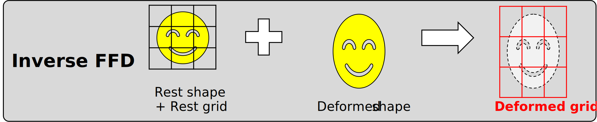
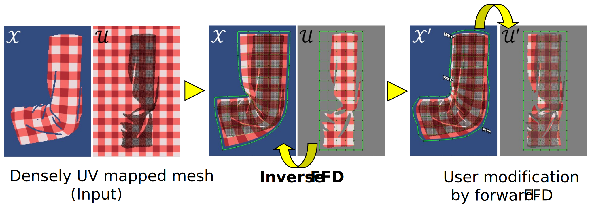

# Inverse FFD

"Inverse Free-form Deformation (FFD) for interactive UV map editing"

- Paper: [[acm]](https://doi.org/10.1145/3478512.3488614) [[author version]](https://drive.google.com/file/d/1FvRCf49Zd3QUYhBXCLe1OltW5PXb93Ve/view?usp=sharing)  
- Presentation: [video [TODO]] [ppt [TODO]]

## At-a-Glance

In a conventional FFD, the ```rest shape``` and ```grid``` were given, and user deforms the grid to get the ```deformed shape```.  


In our **inverse**-FFD, however, ```rest shape```, ```grid``` and ```deformed shape``` were given, and we estimate the ```deformed grid``` from those data.  


We apply this idea to UV map editing. UV (texture) space is to handle ```rest shape``` and ```grid```, and XY (image) space is to handle the ```deformation```.  

