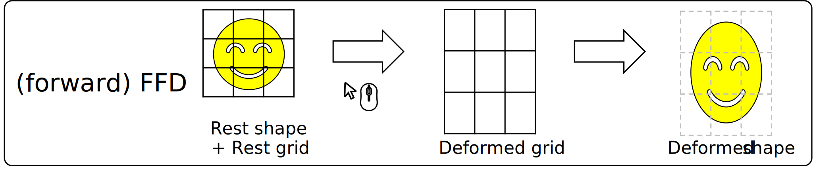

# Inverse FFD

"Inverse Free-form Deformation (FFD) for interactive UV map editing"


## At-a-Glance

In a conventional FFD, the ```rest shape``` and ```rest grid``` were given, and user deforms the grid to get the ```deformed shape```.  


In our **inverse**-FFD, however, ```rest shape```, ```rest grid``` and ```deformed shape``` were given, and we estimate the ```deformed grid``` from those data.  


We apply this idea to UV map editing. UV (texture) space is to handle ```rest space``` and ```grid```, and XY (image) space is to handle the ```deformation```.  


If you want to know the detail, please refer the links below:
- Paper: [preprint] [[acm]](doi.org/10.1145/3478512.3488614)  
- Presentation: [video] [ppt]

## Reference

```bibTeX
@inproceedings{10.1145/3478512.3488614,
    author = {Noh, Seung-Tak and Igarashi, Takeo},
    title = {Inverse Free-Form Deformation for Interactive UV Map Editing},
    year = {2021},
    isbn = {9781450390736},
    publisher = {Association for Computing Machinery},
    address = {New York, NY, USA},
    doi = {10.1145/3478512.3488614},
    booktitle = {SIGGRAPH Asia 2021 Technical Communications},
    articleno = {5},
    numpages = {4},
    keywords = {UV editing, Free-form deformation, least-squares},
    location = {Tokyo, Japan},
    series = {SA '21 Technical Communications}
}
```  
